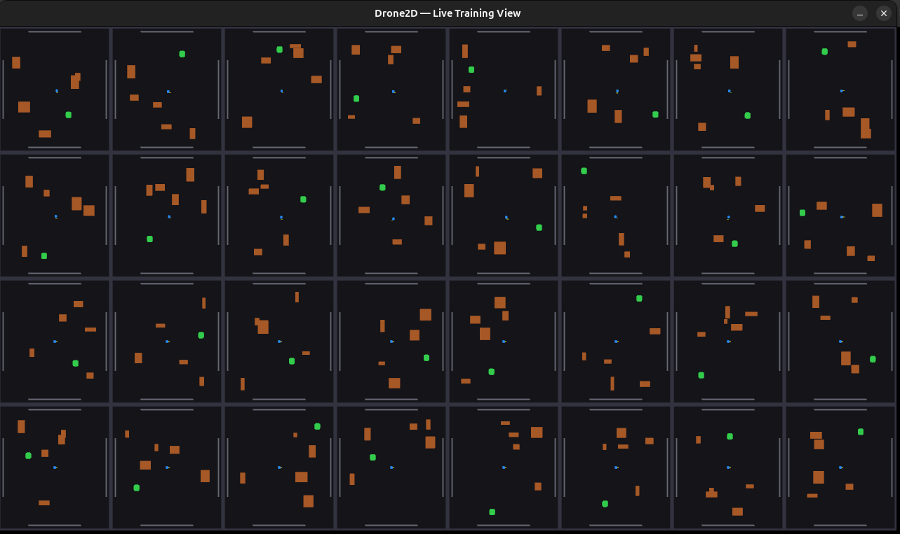
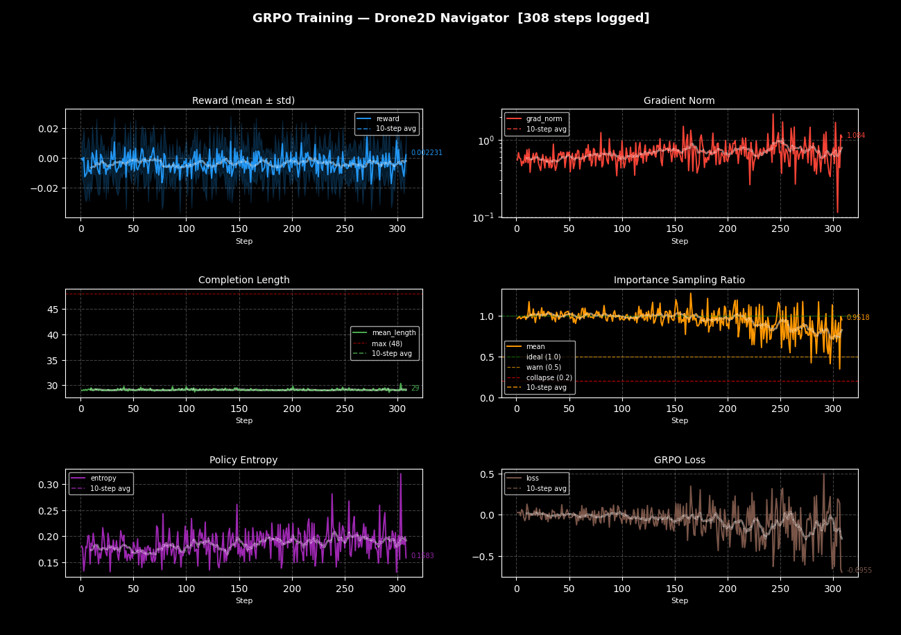
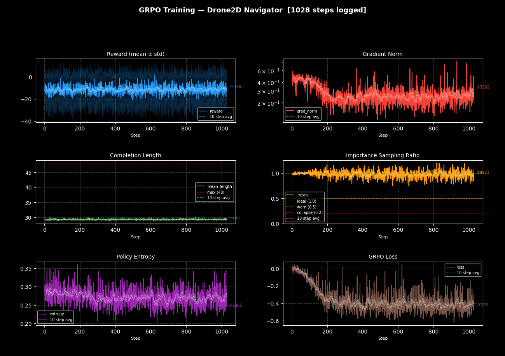
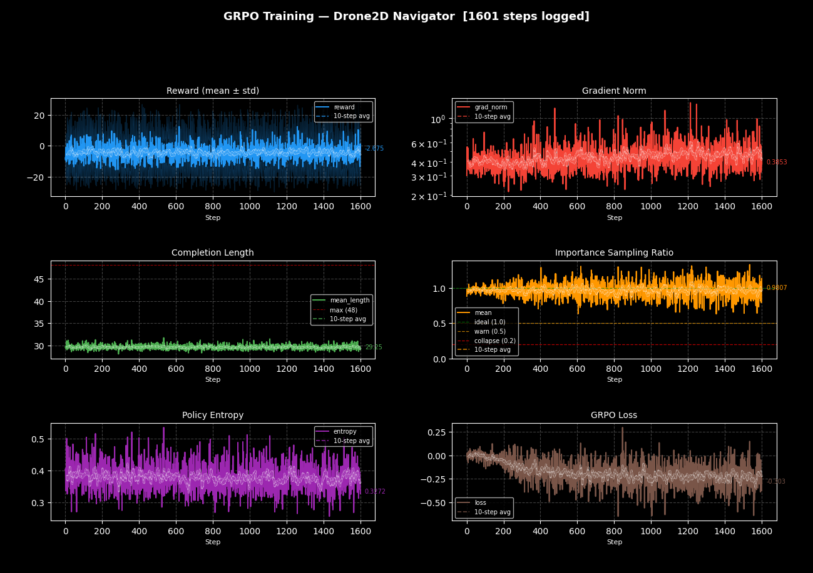
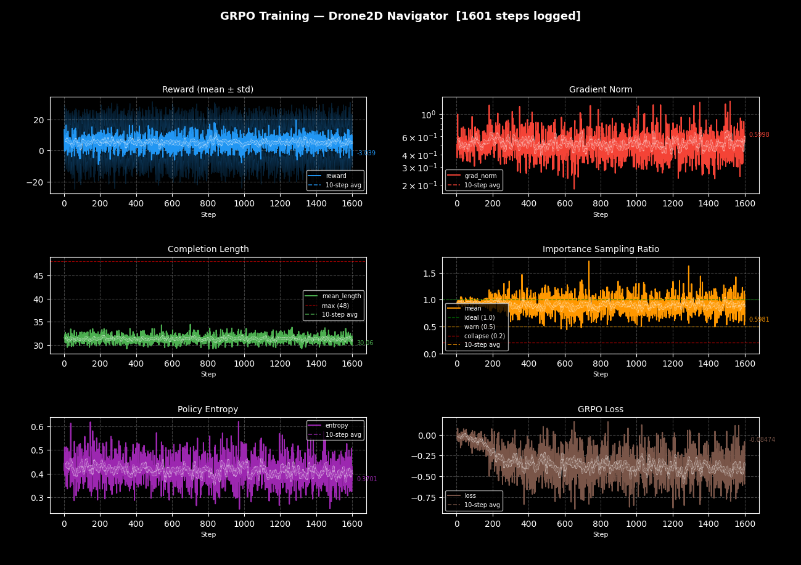
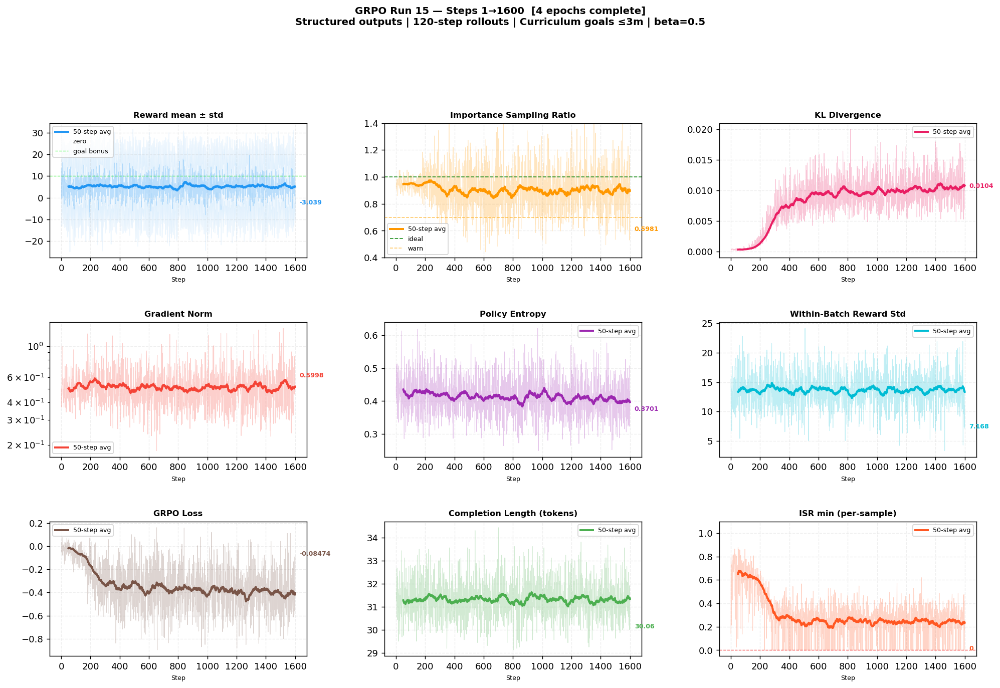
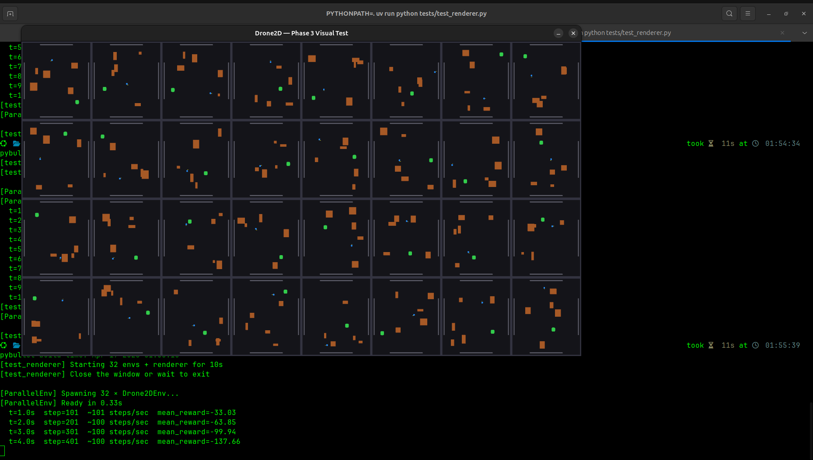

# LLM-in-the-loop Continuous Control (sem 6 work)

A Python-first simulation framework designed to bridge the gap between heavyweight 3D RL platforms (Isaac Lab, Isaac Gym) and the need for simple, parallel, LLM-driven 2D (and optionally 3D) environments. Isaac Lab requires Omniverse, extensive setup, and has no 2D support. This project runs on a standard Ubuntu machine with a single GPU, and is designed from the ground up for LLM-in-the-loop reinforcement learning algorithms like GRPO.



## Core Design Decisions

- **Physics runs on CPU**: With 32–128 parallel rollouts, the bottleneck is LLM generation speed, not physics throughput. PyBullet in `DIRECT` mode (no GUI) runs all heavily-parallel environments headlessly. Switching to 3D is trivial by removing the Z-axis constraints.
- **LLM runs on the same GPU**: vLLM is launched as a local server (`vllm serve`). The sim serializes observations to JSON, fires HTTP requests async to vLLM's OpenAI-compatible endpoint, and gets structured JSON actions via guided generation.
- **Rendering is opt-in and read-only**: ModernGL with a GLFW backend draws all environments as a viewport grid in a single window. Physics and rendering are fully decoupled.
- **Training uses TRL's GRPOTrainer**: The simulator acts as the reward function. QLoRA (4-bit base model + LoRA adapters in bfloat16 to preserve gradient signal) runs on the same GPU as vLLM using TRL's `vllm_mode="server"` / `colocate` mode.

## Full Tech Stack

| Layer | Tool | Role |
|-------|------|------|
| **Physics** | `pybullet` (DIRECT mode) | Rigid body sim, CPU, headless, 2D/3D |
| **LLM inference** | `vllm` (server mode) | Fast batched completions, guided JSON output |
| **RL training** | `trl` (GRPOTrainer) | GRPO policy gradient, reward_funcs API |
| **Finetuning** | `peft` + `bitsandbytes` | LoRA in bfloat16, colocate integration |
| **Async HTTP** | `httpx` + `asyncio` | Non-blocking batched vLLM requests |
| **Rendering** | `moderngl` + `moderngl-window` | OpenGL 3.3+, GLFW head & EGL headless |
| **Package mgmt** | `uv` | Fast dependency resolution |

## Key Architectural Rules

1. **Decoupled State**: PyBullet and ModernGL never share state directly. The sim loop writes a snapshot dict, which the renderer reads.
2. **Structured Output**: vLLM uses `guided_json` (Regex mappings) to guarantee fully parseable action outputs, eliminating hallucinated output penalties.
3. **Headless switch**: A single boolean decides the GLFW vs EGL context constraint natively.
4. **GRPO Reward Function**: The simulation step *is* the reward function. Rollouts provide state sequences, and the simulation calculates scalars directly for GRPO log-probability updates.

## Training Progression & Discoveries

Over the span of 15 distinct training iterations, this project highlighted several critical insights unique to LLM-in-the-loop reinforcement learning:

### Runs 1-6: The Horizon & Reward Constraint
Initially, training updates were evaluated based on 1-step or limited 3-step rollouts. With a high air-drag coefficient configured in the environment (DT = 1/60s), maximum drone outputs resulted in miniscule physical movement. Analysis from Run 6 showed a flatlined **mean reward of -0.0098 over 4,299 steps** with the drone effectively moving roughly 0.005 m/s. The model never experienced a viable reward signal simply because it mathematically could not reach the 3-meter goal radius in 3 steps. Extending the rollout horizon allowed the drone sufficient time to physically compound velocity and discover positive rewards.



### Runs 7-12: Addressing ISR Collapse & Output Formats
Mid-tier runs experienced significant Importance Sampling Ratio (ISR) collapse, where the policy generated free-form JSON that frequently broke or forced credit misassignment between tokens and forces. In Run 11, the drone's average reward was completely stuck at **-11.4** with **0% goal success rate**, and ISR minimums regularly collapsed below 0.1, indicating gradients were being shattered by misassigned token action values. By enforcing `vllm_structured_outputs_regex = DRONE_ACTION_REGEX`, we guaranteed that the LLM only emitted valid Pydantic schemas formatting the exact `force_x`, `force_y` constraints. This directly linked the token completion outputs to the physical rewards.



### Runs 14 vs 15: The P-Controller Heuristic Breakthrough
By Run 14, standard deviations were healthy (averaging 12.38), but the drone was effectively exploring entirely randomly; it routinely plateaued at a **-4.23 average reward** with only a **3.7% goal success rate** over 1601 steps. In fact, 78% of the time, it never moved towards the goal at all (reward <= -0.5).

In Run 15, we modified the `SYSTEM_PROMPT` to insert a direct base heuristic hint:
> *"To move toward the goal, set force_x = dx_to_goal * k and force_y = dy_to_goal * k where k is between 1.0 and 5.0."*

This fundamentally resolved the initial exploration problem. Run 15's performance exploded to a **+5.21 average reward**, hitting a **52.2% goal success rate**. It also triggered long-term efficiency bonuses (`reward > 10`) on **13.8%** of episodes, up from just 0.3% in Run 14. The lesson was clear: giving the LLM a P-controller heuristic rapidly bridges the sparse reward gap, converting the GRPO process from "stochastic exploration from zero" to "tuning dynamic gains (Kd/Kp) and optimizing trajectory efficiently".

**Run 14 (Pure Random Exploration - Plateaus negatively)**


**Run 15 (With P-Controller Heuristic Prompt - Instant learning & positive rewards)**




---

## Testing raw code

### 1. Installation
```bash
uv python pin 3.12
uv add pybullet numpy moderngl moderngl-window glfw
```

### 2. Unit & Integration Tests

**Physics Test**:
```bash
PYTHONPATH=. uv run python tests/test_physics.py
```

**Parallel Instances Test**:
```bash
PYTHONPATH=. uv run python tests/test_parallel.py
```

**Rendering Test**:
```bash
PYTHONPATH=. uv run python tests/test_renderer.py
```


**LLM Mock Mode**:
```bash
PYTHONPATH=. uv run python tests/test_llm_client.py --mock
```

### 3. Simulation Live Mode (Requires approx. 8.5GB VRAM)

**Launch vLLM server (Terminal 1)**:
```bash
uv run vllm serve Qwen/Qwen2.5-1.5B-Instruct \
  --dtype bfloat16 \
  --gpu-memory-utilization 0.60 \
  --max-num-seqs 64 \
  --max-model-len 2048 \
  --port 8000
```

**Run Simulation (Terminal 2)**:
```bash
PYTHONPATH=. uv run python tests/test_runner.py --steps 60
```
*(Add `--headless` to run without ModernGL visual rendering).*

## Pitfalls

- The installation of this project is complex and required working with specific versions of specific modules
- GPU OOM can break the training run
- Some missing .so files need to be installed
- There might be GLIBC errors (depending on the system)
- Torch and trl have conflicting CUDA dependencies and the specific ones that dont are noted in `run.sh`

## Multimedia

### Image of live training


### Video of live training

